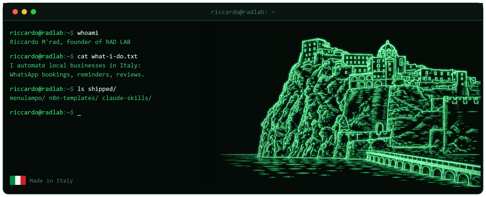

# Ciao, sono Riccardo 👋

Ho fondato **RAD LAB**: automatizzo le parti noiose del lavoro di chi ha un'attività locale, in Italia 🇮🇹.

Ristoranti, hotel, saloni e studi medici hanno tutti lo stesso problema: il telefono squilla mentre hai le mani occupate. Io faccio rispondere WhatsApp al posto loro. Prenotazioni, conferme, promemoria, richieste di recensione. Nessuna AI che chiacchiera con i clienti veri, solo percorsi fissi che fanno sempre la stessa cosa.

Prima di questo ho fatto lo scaffalista, il cameriere e l'autista di consegne. Queste attività le conosco da dentro, non da una presentazione.

## Cosa trovi qui

Tutto quello che pubblico è codice che gira già in produzione per clienti paganti, ripulito e documentato in inglese.

| Repo | Cos'è |
|---|---|
| [n8n-hospitality-templates](https://github.com/riccardomrad/n8n-hospitality-templates) | Workflow n8n pronti da importare: prenotazioni WhatsApp, promemoria, recupero no-show, richieste di recensione |
| [claude-skills](https://github.com/riccardomrad/claude-skills) | Le skill di Claude Code che uso ogni giorno per costruire e mandare avanti tutto questo |

## Cose che ho consegnato

- **[MenuLampo](https://menulampo.it)** menu QR per ristoranti che si aggiornano in pochi secondi da un messaggio WhatsApp. Sette lingue, allergeni, aggiornamento in tempo reale, nessuna app da installare
- **[quagliarie.menulampo.it](https://quagliarie.menulampo.it)** un cliente vero, in produzione
- **[crù.menulampo.it](https://xn--cr-pka.menulampo.it)** il menu di un'ittioteca, dominio con la lettera accentata compresa
- **[radlab.it](https://radlab.it)** il sito dell'attività

## Strumenti

n8n, PostgreSQL, Docker, Traefik, Cloudflare Workers e Pages, Hetzner, Astro, Python, Bash, Claude Code.

## Come lavoro

Attività di una persona sola, responsabilità di produzione, nessun collega che para gli errori. Quindi: revisione prima del commit, prova sul telefono vero prima della consegna, backup che ho davvero riprovato a ripristinare, e la via di ritorno scritta prima di toccare qualcosa in produzione.

## Contatti

Se hai un'attività locale e vuoi che ti monti una di queste cose, o vuoi solo chiedermi di un workflow:

- Sito: [radlab.it](https://radlab.it)
- Email: riccardo@radlab.it

---

🇬🇧 **English:** [read this page in English](README.md)

*Fatto in Italia, su un'isola dove le scadenze le decide il traghetto.*
