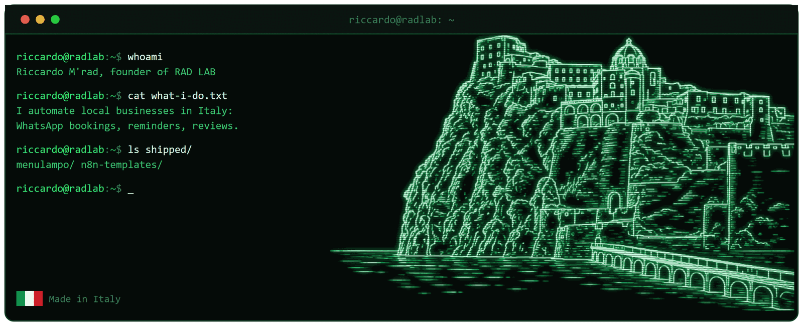

  
  
  
  

## Ciao, sono Riccardo 👋

Ho fondato **RAD LAB**: automatizzo le parti noiose del lavoro di chi ha un'attività locale, in Italia 🇮🇹.

Ristoranti, hotel, saloni e studi medici hanno tutti lo stesso problema: il telefono squilla mentre hai le mani occupate. Io faccio rispondere WhatsApp al posto loro. Prenotazioni, conferme, promemoria, richieste di recensione. Nessuna AI che chiacchiera con i clienti veri, solo percorsi fissi che fanno sempre la stessa cosa.

Prima di questo ho fatto lo scaffalista, il cameriere e l'autista di consegne. Queste attività le conosco da dentro, non da una presentazione.

## Cosa sto costruendo

**[MenuLampo](https://menulampo.it)** menu QR per ristoranti che si aggiornano in pochi secondi da un messaggio WhatsApp. Sette lingue, allergeni, aggiornamento in tempo reale, niente da installare per chi è a tavola.

**[RAD LAB](https://radlab.it)** l'attività: automazioni, software e siti per le attività locali.

## Codice aperto

<table>
  <tr>
    <td valign="top"><a href="https://github.com/riccardomrad/n8n-hospitality-templates"><b>n8n-hospitality-templates</b></a></td>
    <td>Workflow n8n pronti da importare per le prenotazioni ristorante su WhatsApp: crea e conferma, gestisce la risposta del cliente, manda il promemoria 24 ore prima, intercetta gli errori. Documentazione in inglese e in italiano.</td>
  </tr>
</table>

Tutto quello che pubblico è codice che gira già in produzione per clienti paganti, ripulito e documentato.

## Strumenti

`n8n` `PostgreSQL` `Docker` `Traefik` `Cloudflare Workers` `Hetzner` `Astro` `Python` `Bash` `Claude Code`

## Come lavoro

Attività di una persona sola, responsabilità di produzione, nessun collega che para gli errori. Quindi: revisione prima del commit, prova sul telefono vero prima della consegna, backup che ho davvero riprovato a ripristinare, e la via di ritorno scritta prima di toccare qualcosa in produzione.

## Contatti

Se hai un'attività locale e vuoi che ti monti una di queste cose, o vuoi solo chiedermi di un workflow: [radlab.it](https://radlab.it) oppure riccardo@radlab.it

---

🇬🇧 **English:** [read this page in English](README.md)

*Fatto in Italia, su un'isola dove le scadenze le decide il traghetto.*
